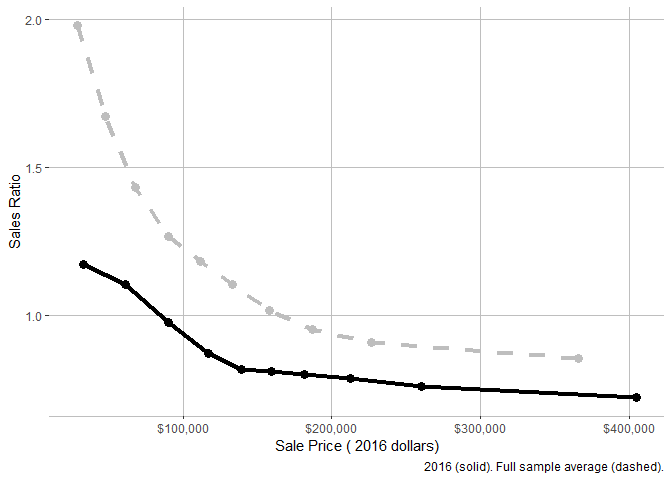
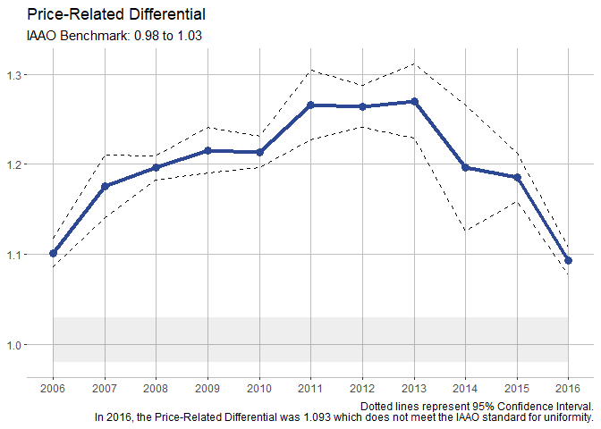
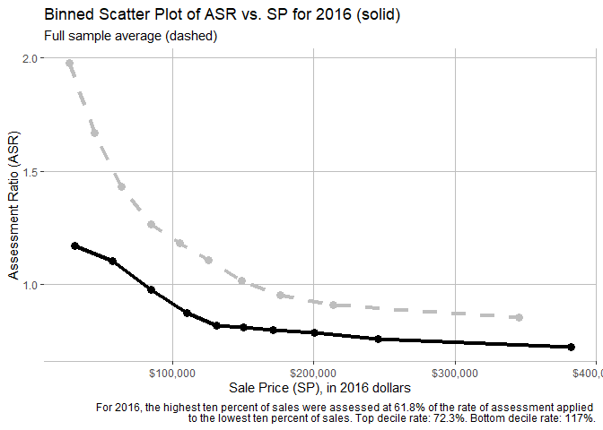

<!-- README.md is generated from README.Rmd. Please edit that file -->

# cmfproperty

This package analyzes property tax regressivity and produces various
tables and figures for a sales ratio study.

## Installation

You can install the development version from
[GitHub](https://github.com/) with:

``` r
# install.packages("devtools")
devtools::install_github("erhla/cmfproperty")
```

## Example

This is the basic framework to conduct a sales ratio study:

``` r
library(cmfproperty)
df <- cmfproperty::example_data
df <-
  cmfproperty::reformat_data(
    df,
    sale_col = "SALE_PRICE",
    assessment_col = "ASSESSED_VALUE",
    sale_year_col = "SALE_YEAR",
    filter_data = TRUE
  )
#> [1] "Filtered out non-arm's length transactions"
#> [1] "Inflation adjusted to 2018"
stats <- cmfproperty::calc_iaao_stats(df)
head(stats)
#>       N     COD COD_SE    PRD PRD_SE     PRB PRB_SE  q1_ratio median_ratio
#> 1 11448 15.6137 5.0551 1.0646 0.0099 -0.0706 0.0026 0.7463933    0.8350732
#> 2 12341 16.2292 5.1543 1.0440 0.0034 -0.0737 0.0025 0.8122727    0.9000000
#> 3 14002 18.3047 6.6167 1.0723 0.0052 -0.0868 0.0027 0.7787830    0.8794514
#> 4 13449 19.9949 5.7487 1.0734 0.0084 -0.0887 0.0029 0.7556391    0.8543689
#> 5 13743 22.0037 6.5136 1.0844 0.0054 -0.1301 0.0032 0.8974978    1.0068293
#> 6 12634 27.0158 8.4432 1.1467 0.0099 -0.1967 0.0036 0.9369951    1.0879731
#>    q3_ratio q1_sale median_sale q3_sale q1_assessed_value median_assessed_value
#> 1 0.9407725   68900    108162.5  146525             55075                 87100
#> 2 1.0040000   71500    113000.0  153000             63500                 99600
#> 3 1.0219354   65000    107750.0  153000             57000                 91100
#> 4 1.0000000   70100    114900.0  160000             61000                 94600
#> 5 1.2715880   62500    105000.0  153000             66500                105200
#> 6 1.4789264   53000     95000.0  149500             67000                106000
#>   q3_assessed_value Year
#> 1            120700 2002
#> 2            136000 2003
#> 3            133400 2004
#> 4            136400 2005
#> 5            153000 2006
#> 6            153975 2007
```

Data is required to have at least three columns, Sale Year, Sale Price,
and Assessed Value.

``` r
head(cmfproperty::example_data)
#>        PID ASSESSED_VALUE SALE_YEAR SALE_PRICE
#> 1 10015586          52600      2002      70000
#> 2 10031205          44700      2002        500
#> 3 10057963          36800      2002      61900
#> 4 10057964          40300      2002      67000
#> 5 10025322          61500      2002     102000
#> 6 10057089         120900      2002     258000
```

reformat\_data then adds additional calculated fields:

  - RATIO, which is the Sales Ratio (Sale Price / Assessed Value)
  - arms\_length\_transaction, an indicator that the property was sold
    in an arm’s length transaction (calculated using the IAAO standard)
  - SALE\_PRICE\_ADJ, inflation adjusted sale price (adjusted to the
    last year of available data)
  - ASSESSED\_VALUE\_ADJ, inflation adjusted assessed value (adjusted to
    the last year of available data)

<!-- end list -->

``` r
df <- cmfproperty::example_data
df <-
  cmfproperty::reformat_data(
    df,
    sale_col = "SALE_PRICE",
    assessment_col = "ASSESSED_VALUE",
    sale_year_col = "SALE_YEAR",
    filter_data = TRUE
  )
#> [1] "Filtered out non-arm's length transactions"
#> [1] "Inflation adjusted to 2018"
head(as.data.frame(df)) #just to print all the columns
#>        PID ASSESSED_VALUE SALE_YEAR SALE_PRICE TAX_YEAR     RATIO
#> 1 10015586          52600      2002      70000     2002 0.7514286
#> 2 10057963          36800      2002      61900     2002 0.5945073
#> 3 10057964          40300      2002      67000     2002 0.6014925
#> 4 10025322          61500      2002     102000     2002 0.6029412
#> 5 10057089         120900      2002     258000     2002 0.4686047
#> 6 10045583         163600      2002     312500     2002 0.5235200
#>   arms_length_transaction SALE_PRICE_ADJ ASSESSED_VALUE_ADJ
#> 1                       1      100370.59           75421.33
#> 2                       1       88756.28           52766.25
#> 3                       1       96068.99           57784.78
#> 4                       1      146254.29           88182.73
#> 5                       1      369937.32          173354.35
#> 6                       1      448082.99          234580.41
```

More advanced features are available as well:

``` r
cmfproperty::regression_tests(df)
#>         Model         Value Test T Statistic  Conclusion
#> 1    paglin72  4.325107e+04  > 0   253.07047  Regressive
#> 2     cheng74  6.749357e-01  < 1   500.03105  Regressive
#> 3      IAAO78 -2.034027e-06  < 0  -195.83335  Regressive
#> 4    kochin82  8.491533e-01  < 1   500.03105  Regressive
#> 5      bell84  2.883853e+04  > 0   167.10674  Regressive
#> 6             -1.376471e-07  < 0  -194.35497  Regressive
#> 7 sunderman90 -3.927464e+04  > 0   -44.20409 Progressive
#> 8     clapp90  1.216439e+00  > 1   493.80804  Regressive
#>                             Model Description
#> 1                                     AV ~ SP
#> 2                             ln(AV) ~ ln(SP)
#> 3                                  RATIO ~ SP
#> 4                             ln(SP) ~ ln(AV)
#> 5                              AV ~ SP + SP^2
#> 6                              AV ~ SP + SP^2
#> 7 AV ~ SP + low + high + low * SP + high * SP
#> 8               ln(SP) ~ ln(AV) -> ln(AV) ~ Z
```

``` r
plot_ls <-
  cmfproperty::plots(stats,
                     df,
                     min_reporting_yr = 2006,
                     max_reporting_yr = 2016)
plot_ls[[1]]
```

<!-- -->

``` r
plot_ls[[2]]
```

<!-- -->

``` r
plot_ls[[3]]
```

<!-- -->

``` r
plot_ls[[4]]
```

<!-- -->
