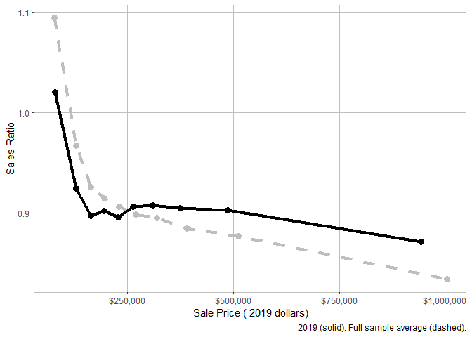

<!-- README.md is generated from README.Rmd. Please edit that file -->

# cmfproperty

This package analyzes property tax regressivity and produces various
tables and figures for a sales ratio study.

## Installation

You can install the development version from
[GitHub](https://github.com/) with:

``` r
# install.packages("devtools")
devtools::install_github("erhla/cmfproperty")
```

## Example

First import `cmfproperty`.

``` r
library(cmfproperty)
```

Then, preprocess your data with `reformat_data` and call `make_report`.
The report will be created in your current working directory by default
unless specified otherwise with parameter `output_dir`. The report from
the example below can be found
[here](https://erhla.github.io/Cook%20County,%20Illinois.html).

``` r
df <- cmfproperty::example_data

ratios <-
  cmfproperty::reformat_data(
    df,
    sale_col = "SALE_PRICE",
    assessment_col = "ASSESSED_VALUE",
    sale_year_col = "SALE_YEAR",
  )

cmfproperty::make_report(ratios, 
                         jurisdiction_name = "Cook County, Illinois"
                         )
```

Let’s break down each of the steps above. First, what kind of data do
you need?

In order to conduct a sales ratio study, data is required to have at
least three columns: Sale Year, Sale Price, and Assessed Value. We want
to compare the sale price to the assessed value at the time of sale.

``` r
head(cmfproperty::example_data)
#>              PIN SALE_YEAR SALE_PRICE ASSESSED_VALUE
#> 1 17273100931118      2015      53000          33860
#> 2 18013090421010      2018      80000          60390
#> 3 12111190201042      2018     118000         108300
#> 4 13093160601015      2017     125500          87200
#> 5 14322110150000      2018    3705000        3670740
#> 6 27021200080000      2016     345000         267280
```

In most cases, producing this data will require a sales roll consisting
of all properties which sold in a given year and an assessment roll
which consists of all properties assessed in a given year. For example,
the `example_data` above was produced from the Cook County Open Data
Portal. Sales were found
[here](https://datacatalog.cookcountyil.gov/Property-Taxation/Cook-County-Assessor-s-Residential-Sales-Data/5pge-nu6u)
and assessments were found
[here](https://datacatalog.cookcountyil.gov/Property-Taxation/Cook-County-Assessor-s-Residential-Assessments/uqb9-r7vn).
These files can be downloaded manually or via `RSocrata`:

``` r
library(data.table)
library(tidyverse)

sales <- fread("~/../Downloads/Cook_County_Assessor_s_Residential_Sales_Data.csv", 
               colClasses = "character") #from 2013 to 2019
assessments <- fread("~/../Downloads/Cook_County_Assessor_s_Residential_Assessments.csv", 
                     colClasses = "character") #from 2015 to 2019

sales <- sales %>% select(PIN, `Sale Year`, `Sale Price`, `Deed No.`) %>%
  filter(`Sale Year` > 2014)

assessments <- assessments %>% select(PIN, YEAR, CERTIFIED)

# Filtering data to remove duplicate sales and low value sales
sales <- sales %>% distinct(`Deed No.`, .keep_all = TRUE) %>% select(-`Deed No.`)
sales <- sales %>% filter(as.numeric(`Sale Price`) > 2500)

# Join assessments to sales based on PIN (a unique identifier) and Year.
joined <- sales %>% left_join(assessments, by=c("PIN"="PIN", "Sale Year"="YEAR"))
joined <- joined %>% rename(SALE_YEAR = `Sale Year`, SALE_PRICE = `Sale Price`, ASSESSED_VALUE = CERTIFIED)

fwrite(joined, paste0("~/../Downloads/example_data.csv"))
```

Then, we need to let the package know which of our columns represent
sales, assessments, and sale year.

``` r
df <- cmfproperty::example_data
ratios <-
  cmfproperty::reformat_data(
    df,
    sale_col = "SALE_PRICE",
    assessment_col = "ASSESSED_VALUE",
    sale_year_col = "SALE_YEAR",
  )
#> [1] "Filtered out non-arm's length transactions"
#> [1] "Inflation adjusted to 2019"
head(as.data.frame(ratios)) #just to print all the columns
#>              PIN SALE_YEAR SALE_PRICE ASSESSED_VALUE TAX_YEAR     RATIO
#> 1 17273100931118      2015      53000          33860     2015 0.6388679
#> 2 18013090421010      2018      80000          60390     2018 0.7548750
#> 3 12111190201042      2018     118000         108300     2018 0.9177966
#> 4 13093160601015      2017     125500          87200     2017 0.6948207
#> 5 14322110150000      2018    3705000        3670740     2018 0.9907530
#> 6 27021200080000      2016     345000         267280     2016 0.7747246
#>   arms_length_transaction SALE_PRICE_ADJ ASSESSED_VALUE_ADJ
#> 1                       1       59209.48           37827.04
#> 2                       1       82313.03           62136.05
#> 3                       1      121411.71          111431.26
#> 4                       1      132854.54           92310.09
#> 5                       1     3812122.01         3776871.45
#> 6                       1      376080.37          291358.73
```

`reformat_data` also add the additional calculated fields needed to
complete the study:

  - RATIO, which is the Sales Ratio (Sale Price / Assessed Value)
  - arms\_length\_transaction, an indicator that the property was sold
    in an arm’s length transaction (calculated using the IAAO standard)
  - SALE\_PRICE\_ADJ, inflation adjusted sale price (adjusted to the
    last year of available data)
  - ASSESSED\_VALUE\_ADJ, inflation adjusted assessed value (adjusted to
    the last year of available data)

Note: `ratios` refers to data which has been processed by
`reformat_data`

# Other features

## Calculate Regressivity Statistics

This is the basic framework to conduct a sales ratio study:

``` r
df <- cmfproperty::example_data
ratios <-
  cmfproperty::reformat_data(
    df,
    sale_col = "SALE_PRICE",
    assessment_col = "ASSESSED_VALUE",
    sale_year_col = "SALE_YEAR",
  )
#> [1] "Filtered out non-arm's length transactions"
#> [1] "Inflation adjusted to 2019"
stats <- cmfproperty::calc_iaao_stats(ratios)
head(stats)
#>       N     COD COD_SE    PRD PRD_SE     PRB PRB_SE  q1_ratio median_ratio
#> 1 51879 19.0847 6.6618 1.0775 0.0066 -0.0514 0.0012 0.7758364    0.9093448
#> 2 62852 19.6790 6.7343 1.0838 0.0056 -0.0462 0.0011 0.7705720    0.9001375
#> 3 65961 20.8489 5.6169 1.0625 0.0093 -0.0269 0.0011 0.7428108    0.8732099
#> 4 65298 18.9213 5.9109 1.0214 0.0021  0.0133 0.0010 0.7470336    0.8856039
#> 5 62041 17.3147 4.8929 1.0226 0.0034  0.0098 0.0010 0.7681042    0.9035000
#>   q3_ratio q1_sale median_sale q3_sale q1_assessed_value median_assessed_value
#> 1 1.057180  148000      230000  375000          136670.0                213430
#> 2 1.060422  148000      229900  365000          133940.0                209150
#> 3 1.031267  155000      235000  365000          136960.0                209380
#> 4 1.021504  159642      239900  370000          132382.5                210645
#> 5 1.036399  164900      245000  372000          140220.0                217690
#>   q3_assessed_value Year
#> 1          331235.0 2015
#> 2          321720.0 2016
#> 3          316300.0 2017
#> 4          331257.5 2018
#> 5          336480.0 2019
```

## Visualize Regressivity Statistics

``` r
iaao_rslt <- iaao_graphs(stats, ratios, min_reporting_yr = 2015, max_reporting_yr = 2019, "Cook County, Illinois")
```

``` r
iaao_rslt[[2]]
```

<!-- -->

``` r
iaao_rslt[[4]]
```

<!-- -->

``` r
iaao_rslt[[6]]
```

<!-- -->

## Advanced Regressivity Statistics

``` r
cmfproperty::regression_tests(ratios)
#>         Model         Value Test T Statistic Conclusion
#> 1    paglin72  3.470212e+04  > 0  135.385620 Regressive
#> 2     cheng74  9.136623e-01  < 1 1348.353690 Regressive
#> 3      IAAO78 -1.430746e-07  < 0  -97.596795 Regressive
#> 4    kochin82  9.359248e-01  < 1 1348.353690 Regressive
#> 5      bell84  2.031487e+04  > 0   77.266036 Regressive
#> 6             -1.811579e-08  < 0 -157.626702 Regressive
#> 7 sunderman90  1.111135e+04  > 0    5.063213 Regressive
#>                             Model Description
#> 1                                     AV ~ SP
#> 2                             ln(AV) ~ ln(SP)
#> 3                                  RATIO ~ SP
#> 4                             ln(SP) ~ ln(AV)
#> 5                              AV ~ SP + SP^2
#> 6                              AV ~ SP + SP^2
#> 7 AV ~ SP + low + high + low * SP + high * SP
```

## Regressivity Plots

``` r
plot_ls <-
  cmfproperty::plots(ratios,
                     min_reporting_yr = 2015,
                     max_reporting_yr = 2019,
                     jurisdiction_name = "Cook County, Illinois")
#> Joining, by = "TAX_YEAR"
```

In 2019, the most expensive homes (the top decile) were assessed at
87.1% of their value and the least expensive homes (the bottom decile)
were assessed at 102.0%. In other words, the least expensive homes were
assessed at <b>1.17 times</b> the rate applied to the most expensive
homes. Across our sample from 2015 to 2019, the most expensive homes
were assessed at 83.4% of their value and the least expensive homes were
assessed at 109.4%, which is <b>1.31 times</b> the rate applied to the
most expensive homes.

``` r
plot_ls[[2]]
```

<!-- -->

In Cook County, Illinois, <b>68%</b> of the lowest value homes are
overassessed and <b>39%</b> of the highest value homes are overassessed.

``` r
plot_ls[[4]]
```

<!-- -->

## Monte Carlo Analysis

``` r
m_rslts <- monte_carlo_graphs(ratios)
gridExtra::grid.arrange(m_rslts[[1]], m_rslts[[2]], m_rslts[[3]], m_rslts[[4]], m_rslts[[5]], m_rslts[[6]], nrow = 3)
```

<!-- -->
